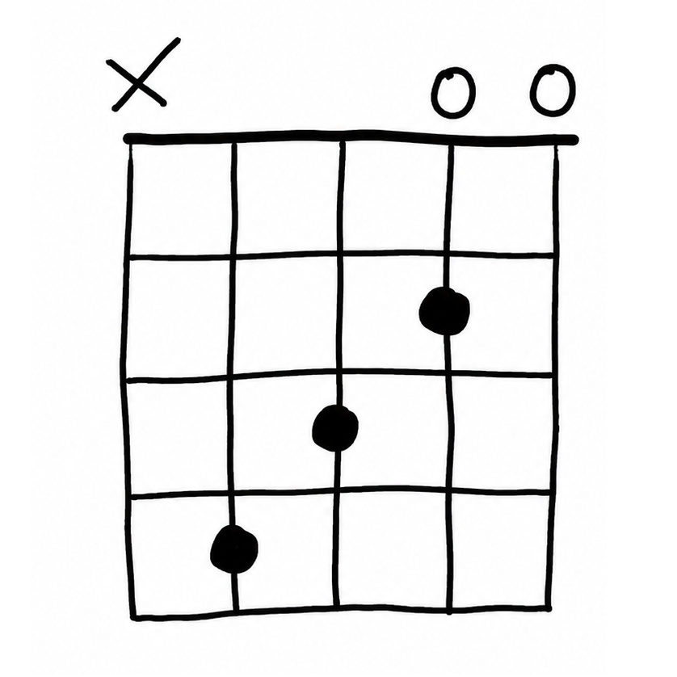
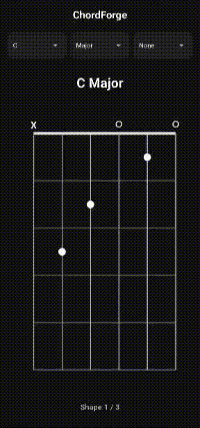

# ChordForge

<div align="center">
  
  <br/><br/>
  
</div>

ChordForge is a minimal, fast, offline-first Flutter application for viewing guitar chord charts. It dynamically renders beautiful guitar fretboards directly on your device, allowing you to easily look up hundreds of chord voicings.

## Features

- **Offline First**: All chord data is stored locally. No internet connection is required.
- **Dynamic Custom Fretboard**: The app uses a highly customized `CustomPainter` to draw strings, frets, fretted notes, open strings, muted strings, and smooth semi-transparent barre shapes.
- **Swipeable Alternate Voicings**: Discover multiple ways to play the same chord. Seamlessly swipe horizontally between alternate movable shapes for any selected chord.
- **Comprehensive Chord Library**: Covers all 12 root notes (C through B) with Major, Minor, Diminished, and Power Chords, plus 7th and add9 extensions. Over 200 distinct movable shapes are included.
- **Minimalist Dark Mode**: Built elegantly with Material 3 and a clean dark aesthetic.

## Getting Started

To run this application locally, ensure you have [Flutter](https://docs.flutter.dev/get-started/install) installed.

1. Clone or download this repository.
2. Navigate to the project directory:
   ```bash
   cd "enter project directory"
   ```
3. Run the application:
   ```bash
   flutter run
   ```

## Architecture Notes

- Built purely with Dart and Flutter (no external third-party dependencies outside of the core Flutter SDK).
- **Core Models**: `ChordShape` and `BarreData` define the precise locations of notes, muted strings, and barre overlays.
- **UI & State**: The application's state is managed simply and efficiently via standard Flutter stateful widgets, keeping the application lightweight and responsive.
- **Algorithmic Data**: The massive local dataset of chord voicings was generated algorithmically based on the CAGED system, transposing E-shape, A-shape, and D-shape templates dynamically up the fretboard.

## Build

To compile a release APK for Android:
```bash
flutter build apk --target-platform android-arm64
```
